# El inframundo la batalla En el Olimpo

## INDICE 

- [El inframundo la batalla En el Olimpo](#el-inframundo-la-batalla-en-el-olimpo)
  - [INDICE](#indice)
    - [Conceptualizacion](#conceptualizacion)
      - [Idea Principal](#idea-principal)
      - [Mecánicas de Juego](#mecánicas-de-juego)
    - [Arte](#arte)
      - [Biomas](#biomas)
      - [Personaje Principal](#personaje-principal)
      - [Enemigos](#enemigos)
      - [Coleccionables](#coleccionables)
      - [Barra de Salud](#barra-de-salud)
    - [Elementos Destacables del Desarrollo](#elementos-destacables-del-desarrollo)
      - [Cambio de Bioma](#cambio-de-bioma)
      - [Funcion Atacar a enemigo](#funcion-atacar-a-enemigo)
      - [Funcion Atacar a Hercules](#funcion-atacar-a-hercules)
      - [Funcion Sumar Vida](#funcion-sumar-vida)

---
### Conceptualizacion
#### Idea Principal

* Es un juego de acción y aventura basado en combate y progresión de habilidades.

* El juego está inspirado en la mitología griega.

* El objetivo es ayudar a Hércules a recuperar el equilibrio del mundo derrotando a Cerbero, la bestia enviada por Hades que impide el acceso al Olimpo.
  
#### Mecánicas de Juego
* **Movimiento del Personaje**

  - Movimiento lateral (izquierda y derecha).

  - Posibilidad de correr.

* **Sistema de Combate** 

  - Hércules basa su combate en su fuerza física sobrehumana.

  - taque básico: Puñetazos.

  - Ataque con espada: Se desbloquea al bajar al Inframundo.

* **Árbol de Habilidades**

  - El jugador puede mejorar a Hércules mediante un sistema de progreso:

  - Espada: Mayor daño al jefe final.

  - Fuerza: Capacidad de romper defensas pesadas.

  - Resistencia: Aumento de vida máxima.

* **Sistema de Vida y Daño**

  - Hércules tiene una barra de vida.

  - Puede aumentar su salud mediante mejoras.

  - Si la vida llega a 0:

  - Se reinicia el nivel desde el último punto de control.

### Arte 
#### Biomas

  - Para este videojuego hemos utilizado distintos tipos de entornos inspirados en el personaje y las distintas pruebas que ha tenido que ir haciendo en la Historia real.
      Para ello hemos implementado tres tipos de biomas diferentes, que son la Grecia antigua, donde tendrá que ir derrotando a los distintos enemigos para poder pasar al siguiente bioma.
      El siguiente bioma sería el inframundo. Una vez que Hércules destruye a los enemigos del primer bioma, consigue pasar al inframundo, donde desencadenará una lucha con otro tipo de enemigos   
      más fuertes que los anteriores. Y, por último, el final del inframundo, donde Hércules realizará una lucha final contra la bestia Cerbero para salvar su mundo.

**Foto bioma 1**:   

  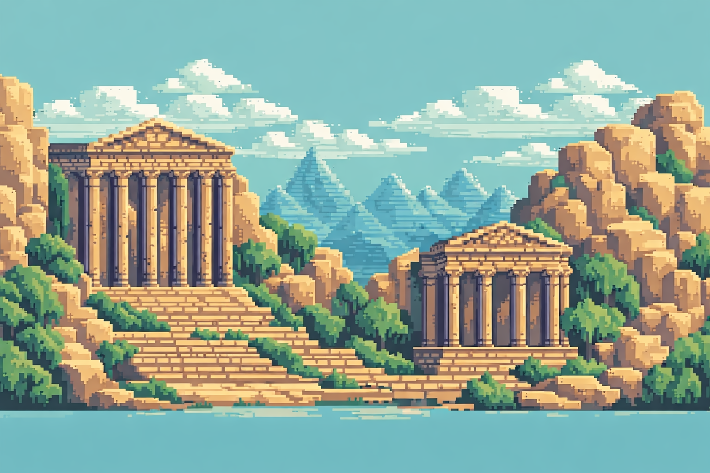  

**Foto bioma 2**:  

  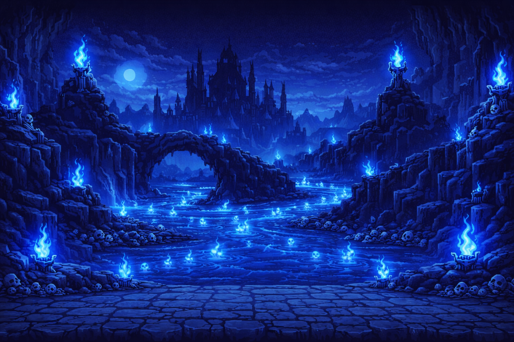  

**Foto Bioma 3** :    

  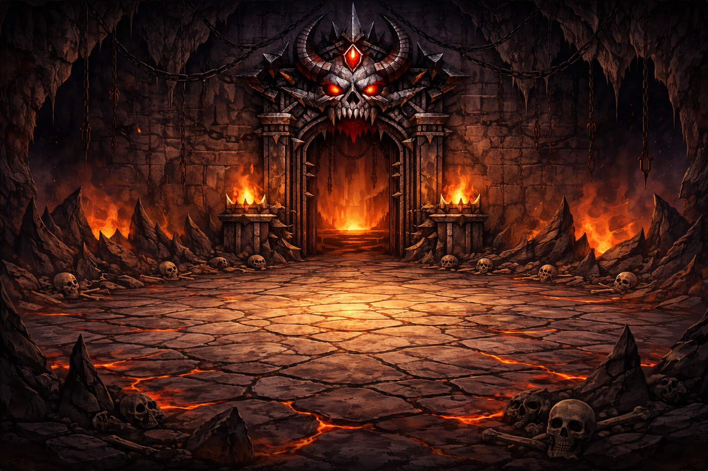  

#### Personaje Principal
   - Para el personaje principal hemos decidido coger unos sprites del Hércules de Disney, ya que es una figura bastante conocida entre las nuevas generaciones y las pasadas.
       El estilo de nuestro personaje es pixel art; eso quiere decir que no es un personaje 2D en sí, ya que está en modo pixelado para que así también tenga un aspecto retro   
       y moderno nuestro juego.

   - El personaje dispondrá de distintos tipos de animaciones. Las principales son el salto, agacharse, postura en reposo, la carrera y, por último, una de las habilidades de   
       Hércules, que es el puño cargado. 
  
  { width=250px } ,   { width=250px },   { width=250px },   { width=250px }  ,   { width=250px }

  

#### Enemigos

   - Para los enemigos hemos decidido utilizar distintos personajes para los distintos tipos de bioma que existen en el juego. En el mundo de Grecia antigua, por ejemplo, el   
    enemigo que custodia Grecia es el Minotauro, que tiene una animación caminando y otra en modo ataque. En el mundo del inframundo, por ejemplo, el enemigo es un demonio   
    muy grande que está custodiándolo. Y, al igual que el Minotauro, tiene la animación de caminar de un lado a otro y la animación de ataque.  
   
     Y para finalizar tenemos a Cerbero, que se encuentra en el Olimpo y tiene una animación moviéndose de un lado a otro y otra en modo ataque. A Cerbero también le hemos   
     añadido una animación de muerte en la que se desintegra incinerándose con su propio fuego.

, { width=250px }, { width=250px }

#### Coleccionables 

  - Para el apartado de coleccionables hemos decidido implementar tres tipos de coleccionables distintos y, para que el juego sea más dinámico, cada coleccionable realizará una acción distinta.
    El primero es el medallón de Hércules, que estará por todos los mapas para ir obteniéndolos conforme pasas de un mundo a otro. Otro es el corazón; este solo aparecerá una vez por mapa y su   
    función es recuperar la salud de nuestro héroe para que así, en la batalla final, pueda derrotar al jefe y ganar el juego.
    Y, por último, la espada de Hades, que se encontrará en el inframundo, en la parte final, y es un objeto que Hércules cogerá para utilizarlo en la última batalla contra la bestia del inframundo.  
    Dicho objeto le permitirá a Hércules implementar un nuevo movimiento con la espada, mucho más potente que el puño, para así poder derrotar a nuestro jefe final.

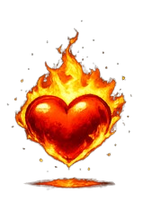, 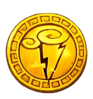

#### Barra de Salud

   - Para la barra de vida hemos implementado dos: una para los enemigos y otra más visual para nuestro personaje principal. La barra de vida del personaje principal aparecerá en todo momento en nuestra 
     pantalla, mientras que la de nuestros enemigos solo aparecerá cuando los tengamos delante de nosotros. Su función es que, cada vez que le den un golpe a nuestro personaje o a un enemigo, se pueda ver   
     cuánta cantidad de vida le queda antes de la muerte.
   
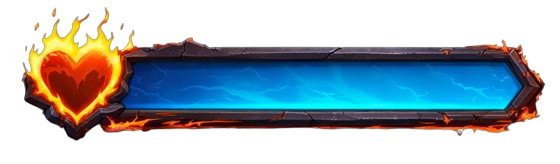, 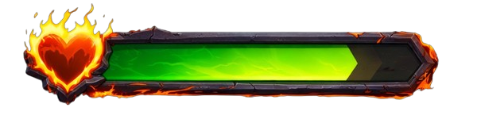, 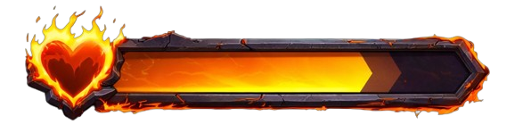, 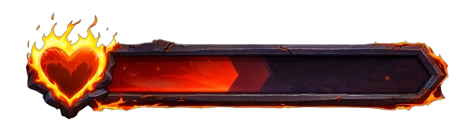

### Elementos Destacables del Desarrollo

#### Cambio de Bioma
- Para poder realizar el cambio de bioma hemos utilizado distintas funciones para que, cuando el personaje toque una colisión que hemos puesto en cada nivel, automáticamente cambie de mapa.
  Los mapas que hemos utilizado están ambientados en el mundo de nuestro personaje. Para poder cambiar de bioma, el personaje pasará por una de estas dos puertas ubicadas en los dos mapas distintos.

 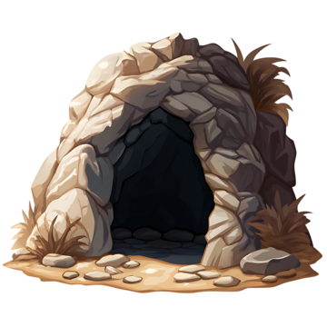{ width=400px }   , 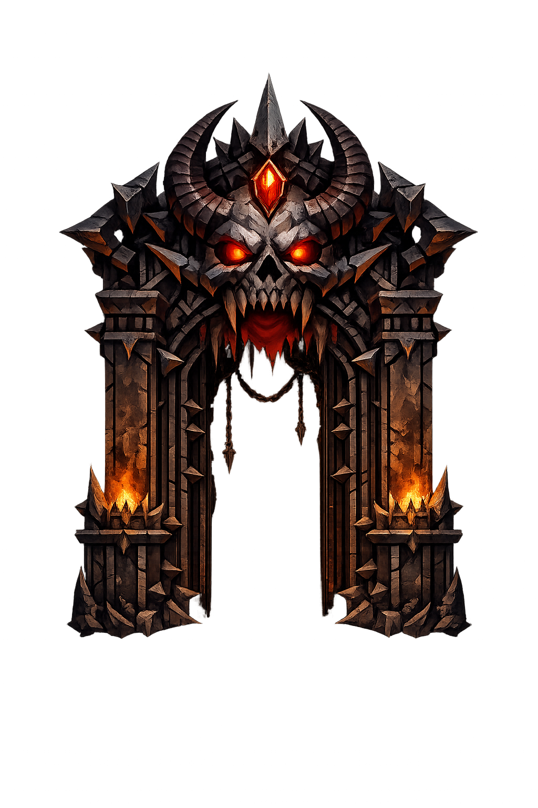{ width=400px }

#### Funcion Atacar a enemigo
- Para poder hacer que nuestro personaje tambien realice daño a los distintos enemigos hemos tenid que añadir una funcion que lo que hace es que si hercules realiza alguno de sus movimientos especiales,  
  los cuales son el puñetazo o utilizar la espada el enemigo recibira daño cada vez que hercules le aseste un golpe.  

    { width=10000px }

#### Funcion Atacar a Hercules
- Para poder hacer que los distintos enemigos ataquen a nuestro personaje hemos añadido funciones distintas para que, cuando nuestros enemigos detecten con una colisión a nuestro personaje, se active la animación 
 de atacar y que, cada vez que toque a nuestro personaje, le vaya quitando vida.

   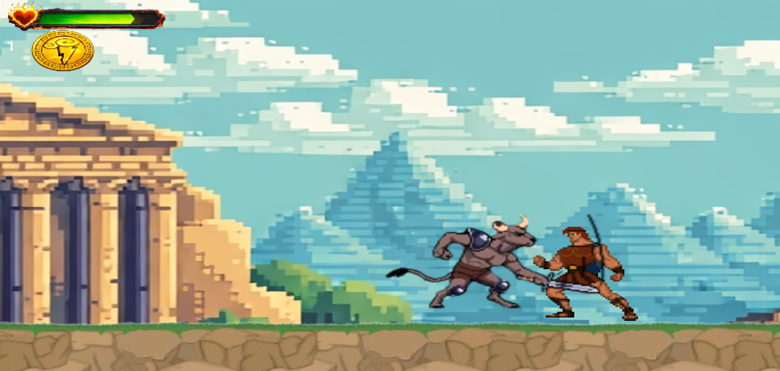{ width=10000px }

#### Funcion Sumar Vida

- Por último, una de las innovaciones que hemos hecho es que Hércules se va a ir encontrando distintos coleccionables por el mapa. Uno de esos coleccionables es un corazón, que lo que hace es que, cada vez que 
 Hércules está herido, se recupera al recoger uno de estos corazones que se encuentran en el suelo.

  { width=10000px }

